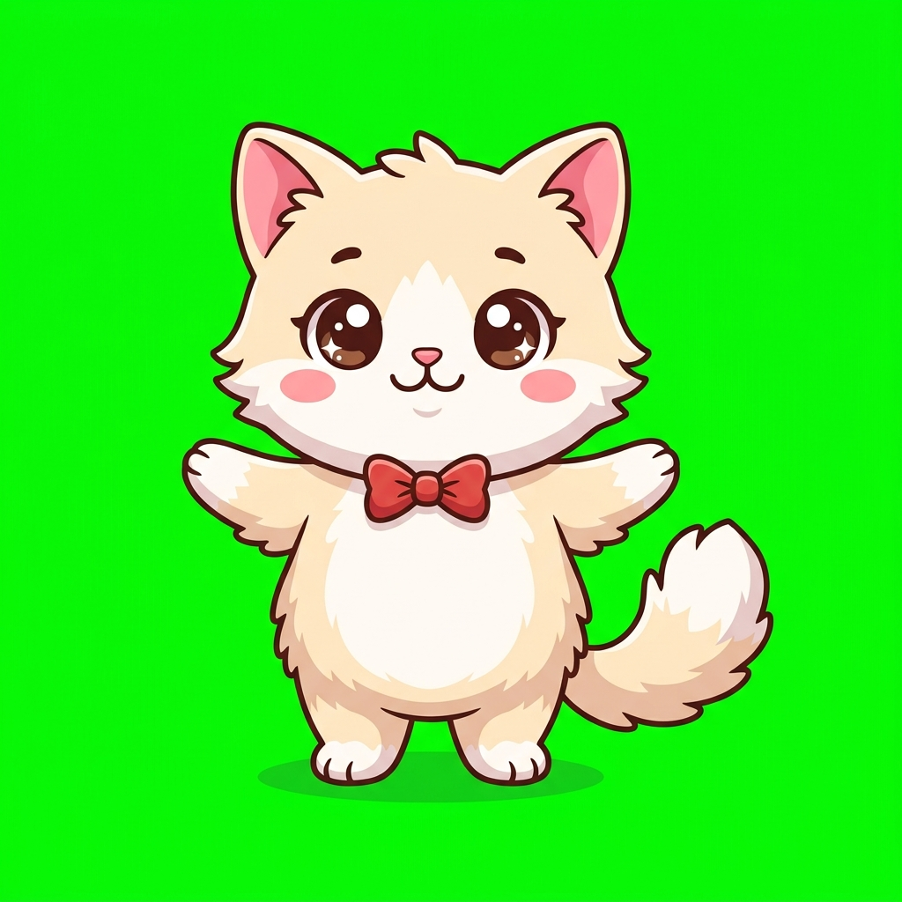
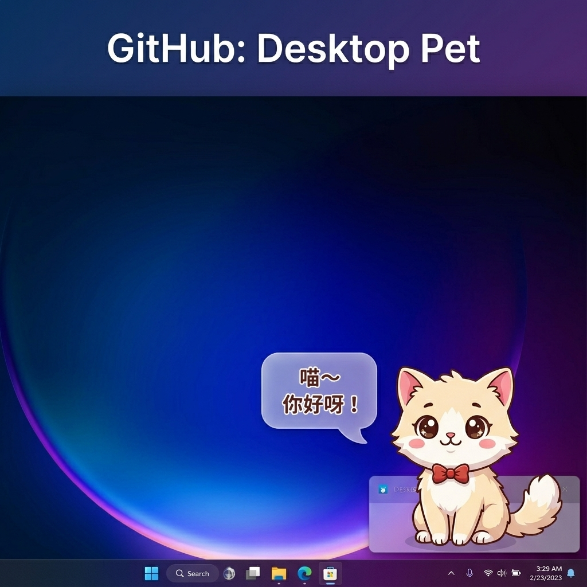

<p align="center">
  
</p>

<h1 align="center">🐱 Desktop Pet</h1>

<p align="center">
  <strong>A cute desktop cat companion that walks, plays, sleeps, and dances on your screen</strong>
</p>

<p align="center">
  English | <a href="README-zh_CN.md">简体中文</a>
</p>

<p align="center">
  
  
  
  
</p>

<p align="center">
  
</p>

---

## ✨ Features

- 🐱 **Adorable Cat** — Cream-colored chibi kitten with a red bow tie
- 🚶 **Auto Walking** — Patrols left and right along the bottom of your screen
- 🖱️ **Drag & Drop** — Grab and toss with physics-based gravity and bounce
- 💬 **Chat Bubbles** — Double-click for random cute dialogues
- 🎭 **Rich Animations** — 8 unique states with dedicated sprite frames
- 👻 **Fully Transparent** — Clicks pass through to your desktop in empty areas
- 📌 **System Tray** — Minimal footprint, manage from tray icon
- 🛡️ **Anti-Lost** — Smart boundary detection across any screen resolution

## 🎭 Animation States

| State | Trigger | Frames | Description |
|-------|---------|--------|-------------|
| 🧍 Idle | Default | 1 | Standing front-facing |
| 🚶 Walk | Auto | 4 | Side-view walk cycle (mirrored L/R) |
| 😊 Happy | Right-click → Pet | 1 | Squinting smile with hearts |
| 🐟 Eat | Right-click → Feed | 2 | Grabbing fish → chomping |
| 🧶 Play | Right-click → Play | 4 | Crouch → swipe → hug yarn → tangled |
| 💤 Sleep | Right-click → Sleep | 2 | Slow breathing rhythm |
| 💃 Dance | Right-click → Dance | 3 | Left sway → arms up → right sway |
| 😱 Drag | Mouse drag | 1 | Startled expression |

## 🚀 Quick Start

### Option 1: Download (Recommended)

Go to [Releases](../../releases) and download the latest build for your OS.

### Option 2: Run from Source

```bash
git clone https://github.com/booleamu/DesktopPet.git
cd DesktopPet
npm install
npm start
```

### Option 3: Build Yourself

```bash
npm run build:win    # Windows
npm run build:mac    # macOS
npm run build:linux  # Linux
```

## 🎮 Controls

| Action | Effect |
|--------|--------|
| **Double-click** pet | Random chat bubble |
| **Right-click** pet | Action menu (Pet / Feed / Play / Sleep / Dance) |
| **Left-drag** pet | Pick up; drops with gravity on release |
| **Right-click** tray icon | Pin to top / Reset position / Quit |

## 📁 Project Structure

```
DesktopPet/
├── assets/                # Sprite assets (19 PNG frames)
│   ├── cat-main.png       # Idle front-facing
│   ├── cat-walk-1~4.png   # Walk cycle
│   ├── cat-happy.png      # Happy expression
│   ├── cat-eat-1~2.png    # Eating frames
│   ├── cat-play-1~4.png   # Playing with yarn
│   ├── cat-sleep-1~2.png  # Sleeping frames
│   ├── cat-dance-1~3.png  # Dancing frames
│   ├── cat-drag.png       # Dragged expression
│   └── tray-icon.png      # System tray icon
├── main.js                # Electron main process
├── preload.js             # Preload script (IPC bridge)
├── index.html             # Page structure
├── style.css              # Styles + CSS click-through
├── pet.js                 # Core logic (state machine + animation)
└── package.json           # Project config
```

## 🏗️ Tech Stack

- **Electron 35** — Cross-platform desktop framework
- **Canvas 2D** — Runtime green-screen removal + frame animation
- **CSS pointer-events** — Click passthrough (replaces `setIgnoreMouseEvents`)
- **GitHub Actions** — Automated cross-platform CI/CD builds

## 🎨 Customize Your Pet

Want a different character? Replace the PNGs in `assets/`:

1. **Format**: PNG with solid green (#00FF00) background
2. **Size**: 512×512 or larger (auto-scaled)
3. **Naming**: Keep existing filenames

Recommended: Use [Nano Banana](https://nanobanana.ai) for consistent AI-generated character art.

## 🤝 Contributing

PRs welcome! Some ideas:

- [ ] 🐶 More pet characters
- [ ] 🎵 Sound effects
- [ ] ⚙️ Settings panel (speed / size / custom dialogue)
- [ ] 🖥️ Multi-monitor support
- [ ] 🧩 Plugin system

## 📄 License

[MIT License](LICENSE) — Free to use. Have fun! 😸

---

<p align="center">
  If you like it, give it a ⭐ Star!
</p>
